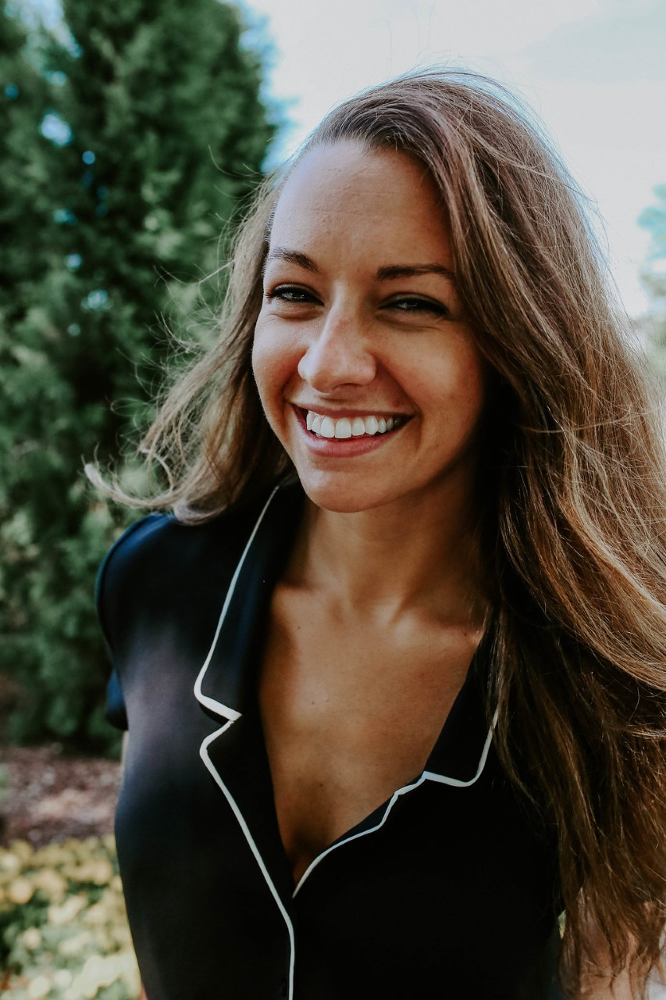

<link rel="stylesheet" href="styles.css" type="text/css">

I am a PhD student at the University of Virginia working with [Max Castorani](https://castorani.evsc.virginia.edu) studying the community ecology of coastal marine ecosystems. I am also a [Virginia Sea Grant](https://vaseagrant.org) Fellow working with the Nature Conservancy's [Virginia Coast Reserve](https://www.nature.org/en-us/about-us/where-we-work/united-states/virginia/stories-in-virginia/virginia-coast-reserve/) on oyster reef restoration. My research also contributes to the work being conducted at the [Virginia Coast Reserve Long Term Ecological Research site](https://www.vcrlter.virginia.edu/home2/). I aspire to build on ecological theory to answer compelling questions at the interface of ecology, conservation, and management.

I completed my BS in Biology (2015) and MS in Biology (2018) working with [David Bass](https://www3.uco.edu/centraldirectory/profiles/5318) at the University of Central Oklahoma.

My full CV is available [here](files/CV_Tedford_June_2020.pdf).